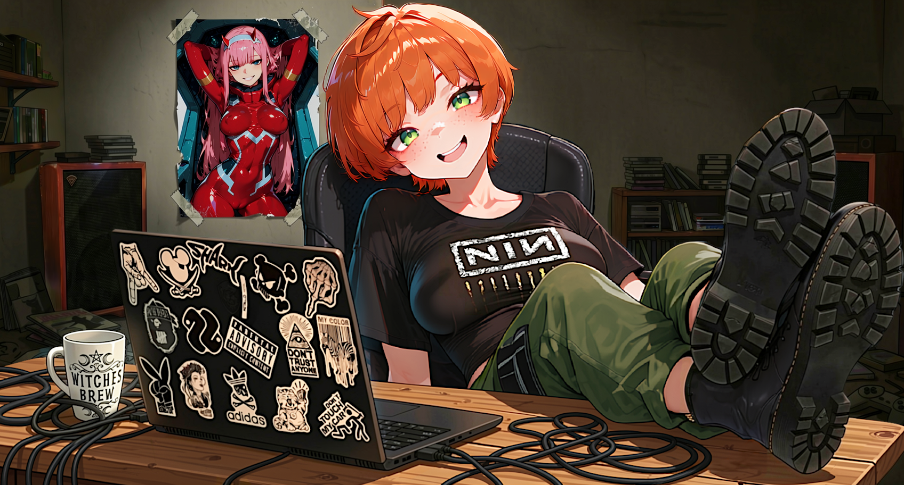

 

 

> *"il Laboratorio di Mario, dove la droga divampa e di figa ce n'è tanta..."*  
> Mario's laboratory tales are all true. And by true, I mean false. It's all lies. But they're entertaining lies. And in the end, isn't that the real truth? The answer is: No

**Welcome to the Lab.**  
I started on an Amiga, moved to PC by mistake, and learned to code because school wasn't going to teach me. Now I write software during degen hours, run Linux, and build utilities that actually do what they say on the tin. No corporate bloat, no telemetry, no performative roadmaps. I build for myself first, fueled by heavy FLAC archives and algorithm-fed playlists, and I share the binaries if they work.

---

| `[UNDEADWALLPAPER]` | `[BACKLOG REAPER]` |  
| :--- | :--- |  
| [**UNDEADWALLPAPER 📱**](https://github.com/maocide/UndeadWallpaper)  ExoPlayer powered, OpenGL transformed live wallpaper engine. No ads, no tracking. | [**BACKLOG REAPER 💀**](https://github.com/maocide/BacklogReaper)  Desktop-native ReAct AI Agent. Parses local SQLite & Vector Embeddings to roast your digital hoarding. |  
| `[HAVOC_ARCHIVE]` | `[PLOTCAPTION]` |  
| [**HAVOC (Est. 2008) 🚀**](https://github.com/maocide/havoc)  2D space game built in pure Python 2.5/Pygame. A relic from before off-the-shelf engines. | [**PLOTCAPTION 🔮**](https://github.com/maocide/PlotCaption)  Local toolchain transforming images into character lore and Stable Diffusion prompts. *(Dormant)* |

---

**HARDWARE & PIPELINE**
*   **Systems:** Linux / Android
*   **Languages:** Amiga Basic, Python, Dart, VB, C#, ASP, PHP, SQL, Java, GLSL, Kotlin (<- *you* read this thing I refuse)
*   **Media:** Gimp, ComfyUI, Local LLMs, VLMs, FFmpeg
*   **Fuel:** Green Tea, Kava 🍃, Sonic Aggression

**COMMUNICATIONS**
*   **Issues:** I have no issue. 
*   **Roadmaps:** Non-existent. 
*   **Support:** I hope it compiles.

 

> **⚠️ DISCLOSURE**
> 
> LLMs may have been utilized to assist in the production or conceptualization of certain software or visual assets. However, all final architectural and artistic decisions were strictly enforced by demi-human intervention. No LLMs were harmed during production.
