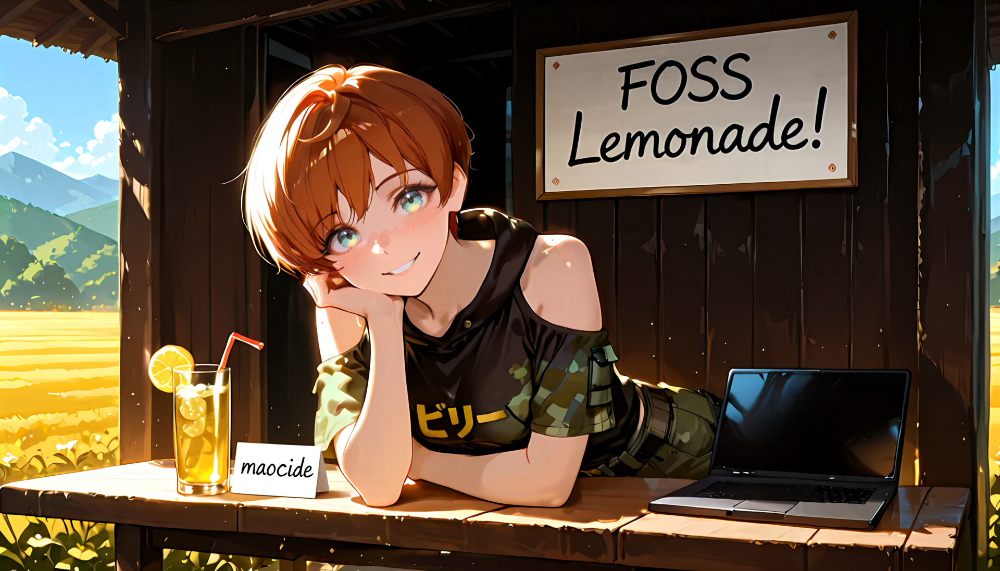

  

### You found my workshop. Welcome.

I'm a developer who believes in two things: FOSS and the power of a good loud FLAC collection. I build honest, no-bullshit software, forged in the quiet hours between midnight and dawn. Each project is proof that the best response to a broken system isn't to fight it, it's to build something better and leave it behind in the dust.

The code here doesn't just run; it haunts. It's the ghost of every "wrong" and every "shouldn't," made real line by line.

---

### 🧊 + 🍋 + 🥤 My FOSS Lemonade Stand (What's Brewing)

<table>
  <tr>
    <td width="50%">
      <a href="#">
        <strong>[COMING SOON] Backlog Reaper 💀</strong>
      </a>
       
      A local, desktop-native ReAct AI Agent built to ruthlessly audit your Steam library. Zero telemetry. Parses local SQLite, Vector Embeddings, and native LLM reasoning to roast your digital hoarding. <i>(Summoning ritual in progress...)</i>
       
       
      
      
    </td>
    <td width="50%">
      <a href="https://github.com/maocide/UndeadWallpaper">
        <strong>UndeadWallpaper 📱</strong>
      </a>
       
      An open-source Android app to breathe life back into your phone, turning any video into a seamless live wallpaper. Actively maintained to survive brutal OEM background-killing quirks. No ads, no tracking.
       
       
      
      
    </td>
  </tr>
  <tr>
    <td width="50%">
      <a href="https://github.com/maocide/havoc">
        <strong>Havoc (Est. 2008) 🚀</strong>
      </a>
       
      A time capsule from the archives. A 2D space game with physics engine and state machine built in pure Python and Pygame before off-the-shelf engines took over. XML-driven, pixel-perfect collisions.
       
       
      
      
    </td>
    <td width="50%">
      <a href="https://github.com/maocide/PlotCaption">
        <strong>PlotCaption 🔮</strong>
      </a>
       
      Your private, uncensored AI muse. A local tool chain that transforms images into rich character lore (TavernAI format) and automates complex prompts for Stable Diffusion. <i>(Currently dormant)</i>
       
       
      
      
    </td>
  </tr>
</table>

---

### 🛠️ The Forge & Fuel

This is the tech that powers the workshop and the fuel that powers the coder:

- **Languages:** "Python", "Kotlin", "Java", "GLSL"
- **Platforms:** "Arch Linux", "Android", "Amiga"
- **AI & ML:** "ReAct Agents", "Vector Embeddings", "ComfyUI", "LLMs", "VLMs"
- **The Essentials:** "My cat", "Sonic Aggression", "Green Tea", "Kava"  🤘

---

### 📫 Signal Flares

- **GitHub Issues:** The primary channel for bugs & feature requests. This is where the work gets done.

 
